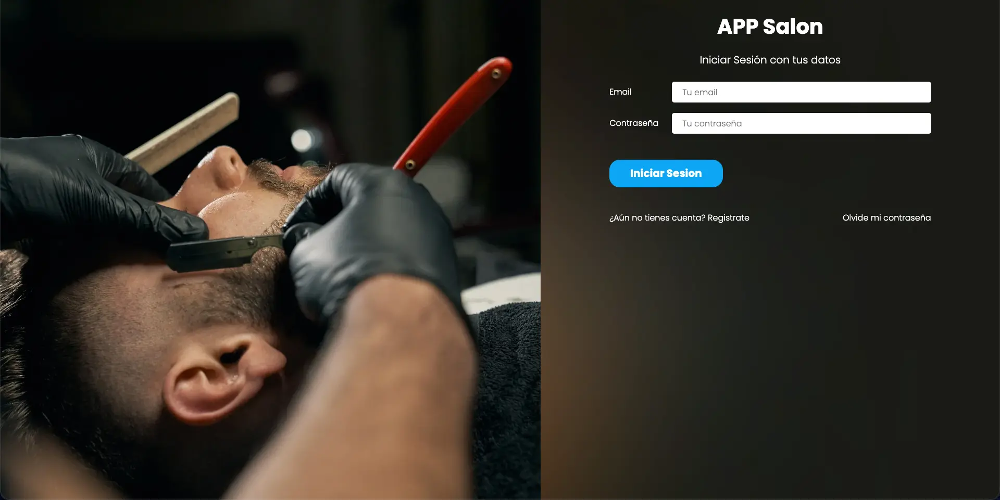
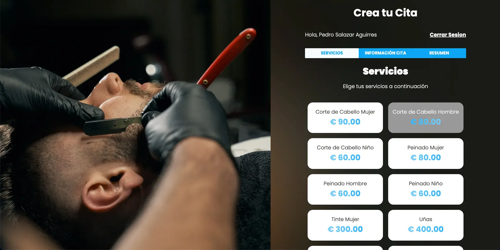
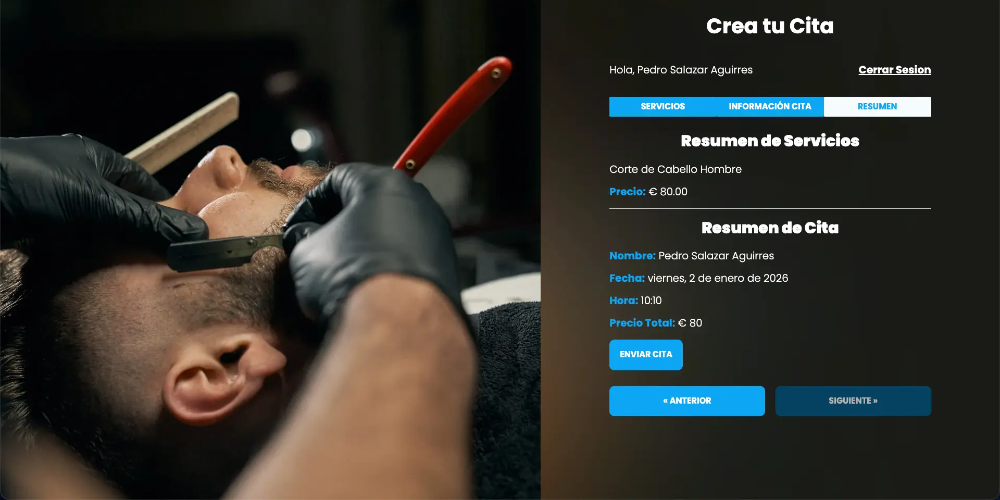
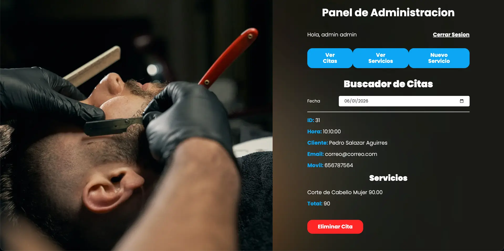

<table width="100%" align="center">
  <tr>
    <td align="center" valign="middle">
      <h1>✂️ AppSalon - Sistema de Gestión de Citas</h1>
      
<b>Arquitectura MVC: Fullstack PHP & Optimización de Assets</b>

      

      
PHP 8 | MySQL | Active Record | SASS | Gulp | JavaScript (Fetch API)

    </td>
  </tr>
</table>

<table>
  <tr>
    <td width="50%">
      

        
      

    </td>
    <td width="50%">
      

        
      

    </td>
  </tr>
  <tr>
    <td width="50%">
      

        
      

    </td>
    <td width="50%">
      

        
      

    </td>
  </tr>
</table>

## Visión General

**AppSalon** es una plataforma integral diseñada para la gestión y reserva de servicios de belleza. El proyecto representa la evolución de un desarrollo web estático hacia una arquitectura de software robusta y escalable.

La aplicación opera bajo el patrón de diseño **Modelo-Vista-Controlador (MVC)**, separando claramente la lógica de negocio, la capa de datos y la interfaz de usuario. El sistema permite:
1.  **Cliente:** Un flujo de reserva interactivo para seleccionar servicios, fecha y hora.
2.  **Administrador:** Un panel de control privado para visualizar y gestionar las citas diarias y los servicios.

Esta arquitectura demuestra el dominio en la construcción de sistemas backend sin dependencia de frameworks pesados, implementando enrutamiento, autenticación y manejo de bases de datos desde cero.

---

## Stack Tecnológico y Justificación de Arquitectura

Cada tecnología fue elegida e implementada para cumplir un rol específico dentro del ciclo de vida de la petición y el rendimiento del frontend:

| Tecnología | Implementación y Justificación en el Proyecto |
| :--- | :--- |
| **PHP 8 (OOP)** | **Core del Backend & Router.** Implementado para construir la arquitectura MVC manualmente. Se encarga de gestionar el enrutamiento de URL amigables, la lógica de los controladores y el manejo de sesiones para la autenticación de usuarios y administradores. |
| **Active Record** | **Patrón de Abstracción de Datos.** En lugar de escribir consultas SQL dispersas, implementé una clase base `ActiveRecord` que heredan todos los modelos (Cita, Servicio, Usuario). Esto permite manipular la base de datos como objetos, sanitizar atributos automáticamente y mantener el código sin repetición. |
| **MySQL** | **Persistencia Relacional.** Base de datos normalizada diseñada para manejar las relaciones complejas entre usuarios y sus citas (1:N) y las citas con múltiples servicios (N:M). Esencial para la integridad de datos en el panel de administración. |
| **JavaScript (Fetch API)** | **Interactividad Asíncrona.** Utilizado en el frontend para crear una experiencia fluida sin recargas. Consume endpoints creados en PHP (API interna) para guardar citas y validar disponibilidad en tiempo real en el calendario y hora, mejorando la UX del formulario de reserva. |
| **SASS** | **Arquitectura CSS.** Implementado para modularizar los estilos mediante parciales y variables. Facilita el mantenimiento del tema visual y permite anidamiento lógico que refleja la estructura HTML de los componentes. |
| **Gulp** | **Automatización de Build.** Configurado como "Task Runner" para optimizar el rendimiento. Ejecuta tareas críticas: compilación de SASS a CSS, minificación de scripts JS y, crucialmente, la conversión de imágenes a formatos modernos (WebP/Avif) para mejorar los tiempos de carga. |

---

## Desafíos Técnicos Resueltos

### 1. Implementación Manual del Patrón MVC
El reto principal fue abandonar la programación procedimental (código espagueti) para estructurar una arquitectura profesional.
* **Problema:** Mezcla de lógica de base de datos y HTML en un mismo archivo dificultaba el mantenimiento.
* Diseñé un **Router** personalizado en PHP que detecta la URL y el método (GET/POST) para invocar al Controlador correcto. Esto aísla la lógica: el Controlador obtiene datos del Modelo y renderiza una Vista específica, logrando una "Separation of Concerns" total.

### 2. Gestión de Citas y Experiencia de Usuario
Evitar la fricción al momento de reservar y minimizar errores humanos.
* **Problema:** La selección de fechas en formularios tradicionales suele ser confusa, permitiendo seleccionar días no laborales por error.
* Implementé una validación reactiva en el Frontend (JavaScript). Utilizando lógica de fechas (Date object), el sistema detecta y deshabilita visualmente los fines de semana y fechas pasadas en tiempo real. Esto reduce la carga al servidor al prevenir el envío de formularios inválidos desde el cliente, asegurando que la petición que llega al Backend (PHP) contenga datos con formato correcto listos para ser sanitizados y almacenados.

### 3. Sincronización Backend-Frontend (API Interna)
Comunicar el formulario de JS con la base de datos MySQL sin recargar la página.
* Convertí parte de los controladores de PHP para que, en lugar de renderizar vistas HTML, retornaran respuestas **JSON**. Esto permitió que `fetch` en JavaScript pudiera enviar los IDs de los servicios seleccionados y recibir confirmación de éxito/error asíncronamente, proporcionando feedback instantáneo al usuario (SweetAlert).